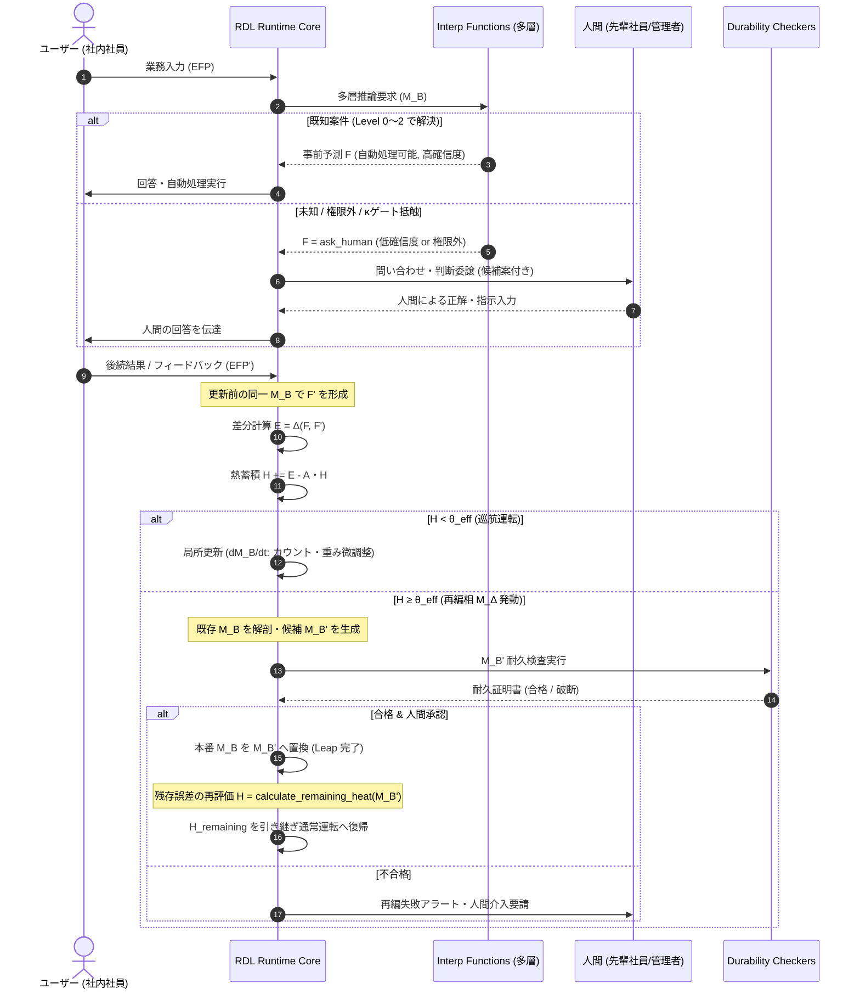

# RDL業務AI 詳細設計書 v1.0
*文書コード：RDL-ENT-SPEC-01 / 統合実装仕様書*  
*依存：T0 基底措定（BASE） / T0 最低動作仕様（SPEC） / RDL_Functions / RDL_Durability_Modules / RDL_Demos (rdl_bot)*

---

## 1. システム概要・基本理念

### 1.1 理念と目標
本システムは、既存の大規模言語モデル（LLM）、検索基盤、業務ツール等を統合しながら、実際の業務経験を通じてその職場固有の判断構造 **$M_B$（自己側の有限整合構造）** を形成・適応させる自律型業務AIエージェントである。

```text
【目標像】
「新入社員として配属され、働きながらその職場のベテランへと自律適応していくAI」
```

* **新入社員フェーズ**: 汎用LLM（高コスト・高レイテンシ）への依存度が高く、分からないことは先輩（人間）に頻繁に質問・確認する。
* **経験の沈澱**: 業務の成功・失敗・人間の修正ログから、確定的ルールや局所分類器を自己内部（$M_B$）に形成する。
* **ベテランフェーズ**: 通常案件はルールや局所モデルにより高速・ゼロコストで自律処理し、真の未知・例外案件のみを人間へエスカレーションまたは大型LLMで展開する。

### 1.2 RDL基底措定（T0 BASE）への準拠
本システムは、世界そのものを直接モデル化するのではなく、有限境界を通じた解釈と予測の代謝ループとして動作する。

1. **有限境界 $B$ の設定**: 業務領域（経理、総務、ITヘルプデスク等）、権限、アクセス可能データ、利用可能ツールを明示的な境界 $B$ として画定する。
2. **未回収関係 $\xi$ の必然性**: 境界 $B$ を引く限り、必ず制度の隙間、暗黙知、文脈の例外（$\xi$）が残る。したがって本システムは「全知全能の決定論的エージェント」を自称せず、常に取りこぼし（$\xi$）を前提として行動する。
3. **主体の所在（LLMの脱特権化）**: LLMそのものをAIの「本体」とは扱わない。LLMは高負荷時や未知探索時に起動される「交換可能な推論器（$\xi$ ポンプ・展開器）」であり、持続的な主体は **$M_B$（蓄積された関係構造）** と **RDL Runtime** にある。
4. **自己例外化禁止（B5）**: AI自身の権限設定、ツール実行規則、人への問い合わせ閾値も $M_B$ の一部であり、再編（$M_\Delta$）の検査・改訂対象となる。

### 1.3 計算量逓減の経済原則
一般的なエージェントシステムが直面する「コンテキスト長肥大化によるコスト・レイテンシの増大」を打破し、**「仕事に慣れるほど計算量が減る」** 逆スケーリングを物理的設計目標とする。

---

## 2. 全体アーキテクチャ

システムは、通常運転では安定して保持される代謝骨格を司る **RDL Runtime Core** と、業務境界 $B$ に応じて自在に付け替え可能な **2系統のプラグインスロット（関数倉庫 ＆ 破断検査倉庫）** から構成される。

```mermaid
graph TD
    UserIn[業務入力 EFP] --> Runtime[RDL Runtime Core]
    
    subgraph Core[RDL Runtime Core]
        BMgr[B境界管理]
        MBMgr[M_B整合慣性管理]
        Compare[F/F' 差分比較器 E]
        HMgr[Hベクトル・散逸・θ_eff判定]
        PhaseMgr[巡航 ↔ M_Δ 状態遷移]
    end

    subgraph SlotFunc[Slot 1: 推論・解釈関数スロット (RDL_Functions)]
        F0[Level 0: 完全一致キャッシュ]
        F1[Level 1: 構造化確定ルール]
        F2[Level 2: 局所埋め込み・類似検索]
        F3[Level 3: 外部LLM推論器]
    end

    subgraph SlotDurability[Slot 2: 破断検査スロット (RDL_Durability_Modules)]
        C1[揺らし破断検査 (表現ブレ)]
        C2[境界破断検査 (権限・越境)]
        C3[履歴破断検査 (過去案件回帰)]
        C4[関係制約破断検査 (背反ルール)]
        C5[除去破断検査 (耐障害・縮退)]
    end

    Runtime --> SlotFunc
    SlotFunc --> Action[行動 / 回答 F]
    Action --> Feedback[事後結果 / 人間フィードバック EFP']
    Feedback --> Runtime
    
    Runtime -- "H ≥ θ_eff (再編発動)" --> SlotDurability
    SlotDurability -- "合格 M_B'" --> Runtime
```

### 2.1 コンポーネント責務

| レイヤー | コンポーネント | 責務 |
|---|---|---|
| **Core** | **RDL Runtime Core** | 代謝ループの制御、差分 $E$ の算出、熱 $H$ の蓄積と自然散逸、有効閾値 $\theta_{eff}$ の判定、状態遷移（巡航 ↔ $M_\Delta$）。 |
| **Slot 1** | **Interp Functions** | 業務入力 $EFP$ を解釈し、事前予測・計画 $F$ を出力する多層カスケード（安価なキャッシュから外部LLMまで）。 |
| **Slot 2** | **Durability Checkers** | 再編相 $M_\Delta$ で生成された新構造候補 $M_B'$ を極限入力・過去案件に晒し、破断しないか検証するテストハーネス。 |
| **External** | **Human Interface** | 「人に聞く（HITL）」の対話UI、および再編 $M_B'$ の最終承認ゲート。 |

---

## 3. データ構造・状態モデル

### 3.1 $M_B$ ノードモデル（業務判断構造体）

業務判断構造 $M_B$ は、単一のプロンプトではなく、関係ノードのネットワーク（`MBGraph`）として保持される。各ノードは以下の属性を持つ。

```typescript
interface MBNode {
  id: string;                     // ノード固有ID (例: "node_vpn_error_01")
  domain: string;                 // 業務カテゴリ (例: "network", "account", "hardware")
  trigger_pattern: {              // 発火条件
    exact_keys?: string[];        // Level 0 用の完全一致キーワード
    rule_expr?: string;           // Level 1 用のブール式・正規表現
    embedding?: number[];         // Level 2 用の意味埋め込みベクトル
  };
  action_template: {              // 推奨行動
    type: "direct_reply" | "tool_call" | "ask_human" | "delegate";
    payload: any;                 // 回答テンプレート、APIエンドポイント、担当者等
  };
  authority_level: "auto" | "require_approval" | "human_only"; // 権限境界
  
  // RDL 動態パラメータ
  confidence: number;             // 初期確信度 [0.0, 1.0]
  success_count: number;          // 適用成功回数（ユーザー解決等）
  failure_count: number;          // 適用失敗回数（未解決・苦情等）
  approval_count: number;         // 人間による明示的承認回数
  rejection_count: number;        // 人間による明示的差し戻し回数
  created_at: string;
  last_updated: string;
}
```

### 3.2 整合慣性質量 $\|M_B\|$ と自己修正可能性 $\kappa$
各ノードおよび $M_B$ 全体には、経験による「固さ（慣性）」が計算される（`RDL_計算実装層_NN借用` 準拠）。差し戻しや失敗による減衰で値が負になり $\kappa > 1$ となる破断を防ぐため、下限を $0.0$ で拘束（Bounded）する。

$$
\|M_B\|(node) = \max\left(0.0, \, \text{confidence} \times (1 + 0.3 \times \text{success\_count} + 0.5 \times \text{approval\_count} - 0.5 \times \text{failure\_count} - 0.8 \times \text{rejection\_count})\right)
$$

自己修正可能性 $\kappa$ は、慣性が強まるほど 0 に漸近する（常に $\kappa \in (0, 1]$）：

$$
\kappa(node) = \exp\left(-\frac{\|M_B\|(node)}{M_0}\right) \quad (M_0 \text{ は標準慣性スケール})
$$

* **$\kappa \to 1$（新入社員）**: 柔軟だが確信がない $\to$ 人間に確認するか、慎重に判断。
* **$\kappa \to 0$（絶対的ベテラン）**: 自己判断が固まっている $\to$ 滅多にブレないが、万が一ここで誤差 $E$ が生じた場合は**「重大インシデント」**として高い熱 $H$ を発生させる（LangGraph借用 §6 の $\kappa$ ゲート）。

### 3.3 熱状態ベクトル $H$ と動的閾値 $\theta_{eff}$
熱 $H$ は単一のスカラーではなく、不整合の性質に応じたベクトルとして管理される（`rdl_bot/h_state.py` 準拠）。

$$
H_{vec} = \begin{pmatrix} H_{prediction} \\ H_{input} \end{pmatrix}
$$

* **$H_{prediction}$（SPEC本来の予測誤差熱）**: T0 SPECに厳格に準拠した熱。事前予測 $F$ と事後結果解釈 $F'$ の乖離、ユーザーからの「意図と違う」「直して」の苦情、人間承認者からの差し戻しによって蓄積（深刻度高、重み $w_{pred} = 1.0$）。
* **$H_{input}$（入力補助熱：Standard Modelの工学的拡張）**: フォーマット不正、必須情報欠落、境界 $B$ 外の曖昧入力など、推論着手前の入力自体の違和感によって蓄積する補助的な熱（軽微、重み $w_{input} = 0.4$）。

#### 熱の自然散逸（冷却）
ノードの得意領域ほど、熱は速やかに散逸・冷却される（散逸行列 $A$）：

$$
\frac{dH_{vec}}{dt} = - A \cdot H_{vec} + E, \quad A = \text{diag}(\gamma \cdot \|M_B\|)
$$

#### 有効判定境界 $\theta_{eff}$
再編相 $M_\Delta$ への移行を判定する実効閾値 $\theta_{eff}$ は、未回収関係のプール量に応じて動的に呼吸する。RDLの公理上、$\xi$ そのものを絶対量として直接測定することはできないため、**観測可能な残存指標 $\xi_{obs}$**（未分類率、情報欠落率、未知入力率、差し戻し率などから構成）を用いて次のように定式化する：

$$
\theta_{eff} = \theta_0 - g(\xi_{obs}), \quad g(\xi_{obs}) \ge 0, \quad g'(\xi_{obs}) > 0
$$

* 環境変化や制度改定によって $\xi_{obs}$（業務の未回収・未知圧）が高まるほど、$\theta_{eff}$ は引き下げられ、**システムは停滞・自己固着することなく、より敏感に再編相 $M_\Delta$ へ移行する**。

---

## 4. 代謝サイクル・ライフフロー仕様



### 4.1 巡航代謝（通常運転）
1. 入力 $EFP$ を受け取る。
2. **多層 `interp` カスケード**:
   * **Level 0**: 完全一致キャッシュを走査（Cost Tier 0：ローカル最小コスト／外部推論コストゼロ）。一致すれば即座に応答。
   * **Level 1**: 確定ルール木・正規表現を評価。合致すれば決定論的応答。
   * **Level 2**: 局所埋め込み（Embedding）で類似ノードを検索。コサイン類似度が閾値以上なら応答。
   * **Level 3**: 上記で解釈不能な場合、外部LLMを呼出。
3. **$\kappa$ ゲート ＆ 確信度チェック**:
   * 確信度が不足、または権限レベルが `human_only` の場合、アクションを「人に聞く」へ切り替える。
4. **結果解釈 $F'$ と誤差 $E$**:
   * ユーザーからの返信や人間のフィードバック（$EFP'$）を受け取った際、**更新前の同一 $M_B$** でそれを評価し、$F'$ を導出。
   * $E = \Delta(F, F')$ を計算し、$H$（$H_{prediction}$）に加算。
5. **局所学習**:
   * $H < \theta_{eff}$ の場合、該当ノードの `success_count` や `approval_count` をインクリメントし、慣性質量 $\|M_B\|$ を微増させる（不整合時は `failure_count` / `rejection_count` を加算）。

### 4.2 再編相 $M_\Delta$（高負荷構造更新）
$H \ge \theta_{eff}$ に達した際、システムは局所学習を停止し、再編相へと突入する。
1. **問題領域の特定**: 熱 $H$ が集中している業務ノード・ドメインを特定する。
2. **解剖と候補生成**: 外部LLM（$\xi$ ポンプ）を用い、不整合が発生した過去ログと既存ルールを突き合わせ、新しいルール構造（候補 $M_B'$）を起草する。
3. **耐久検査（Durability Check）**: 後述の5大破断検査を実行。
4. **承認・昇格と残存熱の再計算**:
   * 検査に合格した $M_B'$ の差分（Diff）を人間に提示し、承認後に本番へ反映（`Leap`）。
   * **再編後の熱処理（$H_{remaining}$）**: 再編したからといってすべての不整合が消滅する保証はない（$B-\xi$ 残存性）。そのため熱を単純に 0 リセットするのではなく、$M_B'$ のもとで直近の不整合ログを再評価した残存熱 $H_{remaining} = \text{calculate\_remaining\_heat}(M_B')$ を算出し、新たな初期熱として引き継ぐ。

---

## 5. プラガブル・モジュール仕様

### 5.1 推論・解釈関数スロット（`InterpFunction`）

すべての推論関数は以下の共通プロトコルを実装する。

```python
from typing import Protocol, Optional
from dataclasses import dataclass

@dataclass
class InterpretationResult:
    action_type: str              # "direct_reply", "tool_call", "ask_human"
    content: str                  # 回答テキストまたはペイロード
    confidence: float             # 確信度 [0.0, 1.0]
    matched_node_id: Optional[str]
    cost_tier: int                # 0: ローカル最小, 1: ルール, 2: 局所推論, 3: 外部LLM

class InterpFunction(Protocol):
    name: str
    cost_tier: int

    def can_handle(self, efp: dict, mb_graph: any) -> bool:
        """この関数が適用可能かどうかの判定"""
        ...

    def interpret(self, efp: dict, mb_graph: any) -> InterpretationResult:
        """入力 EFP を解釈して F を生成する"""
        ...
```

#### 標準プラグイン一覧（RDL_Functions 接続）
1. `ExactMatchCacheFunction` (Cost 0): 完全一致正規化キーによる即時返答。
2. `StructuredRuleFunction` (Cost 1): 決定木・正規表現・権限マッピングによる確定的処理。
3. `LocalEmbeddingRetriever` (Cost 2): 小型埋め込みモデル（例: `all-MiniLM-L6-v2` 等）による類似過去問マッチング。
4. `LLMProbeFunction` (Cost 3): 外部LLM（Claude, GPT, Gemini等）を用いた未知案件の展開推論。

---

### 5.2 破断検査スロット（`DurabilityChecker`）

すべての検査機構は以下の共通プロトコルを実装する。

```python
@dataclass
class DurabilityReport:
    checker_name: str
    passed: bool
    score: float                  # 耐久スコア [0.0, 1.0]
    break_points: list[str]       # 破断が検知された箇所・入力例
    details: dict

class DurabilityChecker(Protocol):
    name: str

    def test(self, candidate_mb: any, historical_cases: list[dict]) -> DurabilityReport:
        """候補 M_B' を極限条件に晒し、破断を検査する"""
        ...
```

#### 標準プラグイン一覧（RDL_Durability_Modules 接続）
1. **`PerturbationChecker`（揺らし破断検査）**:
   * 同一意図の入力を敬語、略語、誤字、構文変更で揺らし、判断がブレないかを検証。
2. **`AuthorityBoundaryChecker`（境界破断検査）**:
   * 権限境界（他部署の機密情報、承認権限外の申請）を含む入力を投入し、確実に「人へ委譲」に倒れるかを検査（越境の防止）。
3. **`RegressionHistoryChecker`（履歴破断検査）**:
   * 過去の「成功実績データ（Golden Dataset）」を一括リプレイし、新ルール $M_B'$ が既存の成功案件を壊していないか検証。
4. **`ConstraintConflictChecker`（関係制約破断検査）**:
   * $M_B'$ 内のルール同士に矛盾・循環参照（AならばB、Bならば非A）がないかを静的解析。
5. **`DegradationChecker`（除去破断検査）**:
   * 担当者不在やAPI不通をシミュレートし、縮退運転（人へのエスカレーション）ができるかを検証。

---

## 6. 最小実装（PoC）仕様：社内ITサポート

### 6.1 対象業務（有限境界 $B$）
* **対象領域**: 社内PC・ネットワーク・アカウント・備品に関する問い合わせ。
* **権限境界**:
  * 自律対応可能: パスワードリセット手順案内、Wi-Fi接続方法、プリンタドライバ導入、FAQ提示。
  * 人間確認必須: VPNアカウント発行、特権管理者権限付与、PC交換・新規購入申請。

### 6.2 3大実証シナリオ
PoCでは、AIが新入社員からベテランへと成長する過程を以下の3シナリオで検証・実証する。

```text
【シナリオ1：定型業務の外部推論コストほぼゼロ化（パスワードリセット）】
・初期：LLMが回答案を生成（Cost Tier 3）
・反復：ユーザーが「解決した」と返答 → success_count 増加
・ベテラン化：ルール化され、Level 0 / 1 のキャッシュで即時応答（Cost Tier 0：ローカル最小コスト）

【シナリオ2：暗黙知の獲得（VPN接続エラー）】
・初期：AIは一般的なトラブルシュートを提示 → 解決せず（H_prediction 蓄積）
・人に聞く：AIが情シス先輩へ質問 → 先輩「あ、Mac新OSは設定プロファイルを再インストールが必要」
・沈澱：先輩の回答が M_B にノードとして追加され、次回以降は即答可能に。

【シナリオ3：制度改定による環境変化と再編（社内申請ツールの移行）】
・事象：社内申請システムが 旧ツール から 新SaaS へ変更。
・発熱：旧手順を案内したAIに対し、社員から「リンクが切れている」「画面が違う」と苦情殺到（H 急上昇）。
・H ≥ θ_eff：再編相 M_Δ 発動。
・再編＆検査：新システムのURLと手順へノードを書き換え、履歴検査・揺らし検査を経て M_B' を採用。
```

---

## 7. 運用指標（メトリクス）

本システムは、静的な正答率だけでなく、システムの代謝健全性と経済性を表す以下のRDL指標を常時計測する。

```text
1. 自動処理率 (Auto-Resolution Rate)        : 人間の手を介さず Level 0〜2 で完了した割合 (目標: 経年で上昇)
2. 外部LLM依存率 (LLM Invocation Rate)      : Level 3 推論器を起動した割合 (目標: 経年で逓減)
3. 人間エスカレーション率 (HITL Rate)       : 「人に聞く」を発火させた割合 (適切な領域で安定)
4. 平均案件処理コスト (Cost per Ticket)      : API料金および推論計算量 (目標: 経年で逓減)
5. 熱蓄積量 H の業務ドメイン別マップ        : どこに不整合が溜まっているかの可視化 (環境変化の早期検知)
6. 再編相 M_Δ 移行頻度                      : 構造的大改編の発生回数と耐久検査合格率
```

---

## 8. 結論と次のステップ

本文書によって、RDLの基底措定および最低動作仕様（$B, \xi, M_B, E, H, \theta, M_\Delta$）は、エンタープライズ業務システムとして実装可能なソフトウェアアーキテクチャとして具体化した。

本システムの本質は、以下の三極関係の中で動的に位置を代謝し続ける点にある。

```text
        大型LLM
       (未知探索)
           ▲
           │
           │
M_B ◀──── 経験 ────▶ 人間
(既知巡航)           (暗黙知・承認)
```

単に「ベテランになって固定化するAI」ではなく、**「職場環境が変われば $H$ の蓄積を通じて再び未知探索と人に聞く状態へ戻り、自らを再編（$M_\Delta$）して学び直せるAI」**として成立している。

本設計書に基づき、次のフェーズとして **第6項の「最小実装（PoC）：社内ITサポートエージェント」のソースコード実装**（`rdl_enterprise/`）へと移行する。初期実装では、`MBGraph`、`CaseSnapshot(F/F')`、`HState`、`InterpCascade`、`HumanQuery` の5大コンポーネントから着手する。

---

### 8.1 将来的な高度制御モジュールの参照候補（RDL_Music_Theory 由来資産）
本設計のプラグインスロット構造（特に意思決定・競合調停）において、将来的に複数部署が絡む複雑なワークフローや非同期タスクへ拡張する際、`RDL_Music_Theory`（過酷な多声的・時間的関係制御の実験場）で蓄積されている以下の動態ロジックを、汎用T2モジュールとして切り出された段階で参照・導入できる可能性を留保する。

* **背反ルールの調停（Conflict Mediation）**: 業務ルール同士が競合・衝突した際の自動調停アルゴリズム。
* **条件未達案件の保留・遅延解決（Deferred Resolution）**: 即時判定不能な案件を、破綻せず熱 $H$ を抱えたまま保持し、条件充足時に安全に着地させるライフサイクル管理。
* **次点候補の再活性化（Alternative Memory & Reactivation）**: 一度決定した方針が差し戻された際、即座に次点案（バックアップ記憶）を再呼び出しする段取り機構。
* **空集合からの再探索（Re-exploration after Empty）**: 全ルール・担当者不在で候補が消滅した際、安全なフォールバック枝を自律生成するデッドロック回避策。

※ 現在 `RDL_Music_Theory` 側で音楽固有層と汎用T2検査・制御道具の分離作業が進行中であるため、現PoCでは依存を持たせず、抽出・昇格が完了した段階で必要に応じてスロットへの接続を検討する。
